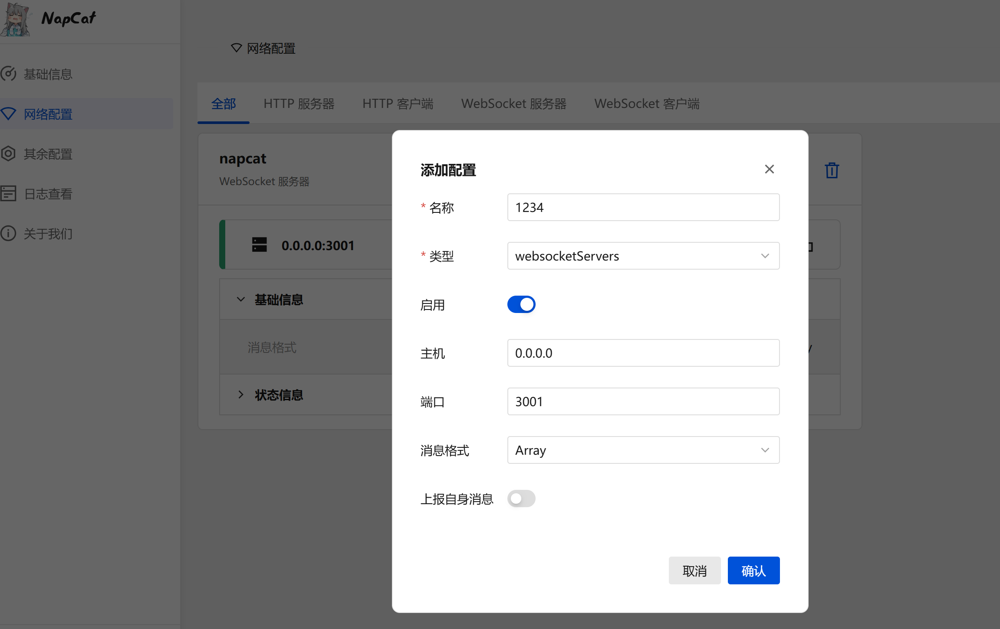

# 基于Shiro的qq机器人
## 介绍
基于Shiro的qq机器人，可以实现QQ消息的自动回复等功能。

::: warning ⚠️声明

1. 本项目遵守 MIT 协议，如需转载请注明作者 ID
2. **请勿滥用，本项目仅用于学习和测试！请勿滥用，本项目仅用于学习和测试！请勿滥用，本项目仅用于学习和测试！**
3. 利用本项目提供的接口、文档等造成不良影响及后果与本人无关
4. 由于本项目的特殊性，可能随时停止开发或删档
5. 本项目为开源项目，不接受任何形式的催单和索取行为，更不容许存在付费内容
6. **上传任何信息时请注意脱敏，删去账户密码、敏感 cookies 等可能泄漏个人信息的数据（例如 `SESSDATA`、`bili_jct` 之类的 cookies）**

:::
## 🌱参与贡献

欢迎各位 dalao 对本项目做出贡献，也希望每个使用者都能提出宝贵的意见

目前本项目存在的问题包括但不限于：
- 代码质量：代码结构不够清晰，缺乏注释，逻辑混乱，可读性差
- 功能：功能不够完善，缺少一些实用的功能，比如定时发送消息、群发消息等
- 文档：文档不够详细，缺少一些必要的说明，比如如何配置 QQ 机器人等
- 安全性：代码中存在一些安全漏洞，比如 SQL 注入等
- 性能：代码中存在一些性能问题，比如内存泄漏等

如果你有意愿参与贡献，欢迎提交 PR，我们一起完善这个项目！
## 计划
- 完成基础功能：包括 QQ 机器人基本功能，包括自动回复、群发消息等

  - [x] 每日签到功能
  - [x] 哔哩哔哩直播推送功能
  - [x] 哔哩哔哩链接解析
    - [x] 解析直播间链接
    - [x] 解析直播间短链接
    - [x] 解析视频链接
    - [x] 解析动态链接
    - [ ] 解析番剧链接
    - [ ] 解析个人空间链接
    - [ ] 解析音频链接
  - [ ] 哔哩哔哩新动态提醒
  - [ ] 文字互动游戏
  - [x] 接入AI大模型
  - 更多功能待开发中...

- 完善文档：包括如何配置 QQ 机器人、如何使用 API 等
- 完善代码：包括代码结构优化、代码注释、代码优化等
- 完善安全性：包括代码安全审计、代码安全防护等
- 完善性能：包括代码性能优化、代码性能测试等
- 完善稳定性：包括代码稳定性优化、代码稳定性测试等
- 完善功能：包括增加定时发送消息、群发消息等功能
- 更多功能待开发中...
## 依赖 / 参考
- [Shiro](https://github.com/MisakaTAT/Shiro) 是一个基于OneBot协议的QQ机器人快速开发框架
- [SpringBoot](https://docs.spring.io/spring-boot)Spring Boot是一个快速、敏捷的开发框架，基于Spring的核心技术，它使得开发者能更加关注业务逻辑，而不是一些底层的配置问题。
- [Maven](https://maven.apache.org/) 是一个项目管理工具，它可以帮助开发者管理项目的依赖关系，自动下载和安装依赖库，并且可以自动构建项目。
- Java 语言 版本 17 及以上
- [MySQL](https://www.mysql.com/) 数据库，用于存储QQ机器人的运行数据,版本) 数据库，用于存储QQ机器人的运行数据,版本) 数据库，用于存储QQ机器人的运行数据,版本 8.0 及以上。
- [Lombok](https://projectlombok.org/) 是一个 Java 库，它可以帮助开发者减少代码量，提高代码可读性。
- [druid](https://github.com/alibaba/druid) 是一个数据库连接池，它可以帮助开发者减少数据库连接的开销，提高数据库连接的效率。
- [Mybatis](https://mybatis.org/mybatis-3/) 是一个持久层框架，它可以帮助开发者将数据库中的数据映射到 Java 对象中。
- [Mybatis-Plus](https://baomidou.com/) 是一个 MyBatis 的增强工具，在 MyBatis 的基础上只做增强不做改变，为简化开发、提高效率而生。
- [bilibili-API-collect](https://github.com/SocialSisterYi/bilibili-API-collect/tree/master) 哔哩哔哩-API收集整理【不断更新中....】
- [DeepSeek](https://api-docs.deepseek.com/) AI大模型
- [fastjson2](https://alibaba.github.io/fastjson2/) 是一个高性能的 JSON 库，它可以帮助开发者将 JSON 数据映射到 Java 对象中。
- [httpcomponents](https://hc.apache.org/) 是一个 Java 库，它可以帮助开发者构建强大的 HTTP 客户端，实现 HTTP 请求的发送、接收、处理等。

## 安装\部署
### 准备工作
1. 安装 JDK 17 及以上版本 <a href = "https://www.runoob.com/java/java-environment-setup.html">安装 java</a>
2. 安装 MySQL 8.0 及以上版本 - [安装 MySQL](https://www.runoob.com/mysql/mysql-install.html)
3. 安装 Maven 3.6.3 及以上版本 - [安装 Maven](https://www.runoob.com/maven/maven-setup.html)
### 克隆项目
```bash
git clone https://github.com/abcLiyew/demo.git
```
> 注意：请确保你的机器上已经安装了 git 工具，否则请先安装 git 工具。
> 如果没有安装 git 工具，请在 `https://github.com/abcLiyew/demo` 页面右上角点击 `Code` 按钮，然后点击 `Download ZIP` 下载项目压缩包并解压。
### 配置数据库
1. 打开 MySQL 或其他数据库管理工具，创建一个名为 `napcatbot` (如果为其他名字，请自行修改配置文件中的数据库名)的数据库。
2. 使用数据库
```mysql
use napcatbot;
```
3.执行项目目录下的 `sql/napcatbot.sql` 文件，创建数据库表。

### 配置项目
1. 打开项目目录下的 `application.yml` 文件，修改数据库连接信息。
```yaml
server:
  port: 12345 #自行修改端口号

shiro:
  ws:
    server:
      enable: false
      url: "/ws/demo"
    client:
      enable: true
      url: "ws://127.0.0.1:3001"

  plugin-list:
    - com.esdllm.napcatbot.MenuPlugin
    - com.esdllm.napcatbot.SignPlugin
    - com.esdllm.napcatbot.BilibiliPushPlugin
    - com.esdllm.napcatbot.BilibiliAnalysisPlugin
spring:
  datasource:
    type: com.alibaba.druid.pool.DruidDataSource
    url: jdbc:mysql://localhost:3306/napcatbot #数据库连接地址，本机为localhost，请自行修改数据库名
    username: root #数据库用户名，请自行修改
    password: root #数据库密码，请自行修改
    driver-class-name: com.mysql.cj.jdbc.Driver
mybatis-plus:
  type-aliases-package: com.esdllm.model
  global-config:
    db-config:
      logic-delete-field: isDelete  #全局逻辑删除
      logic-delete-value: 1 # 逻辑已删除值
      logic-not-delete-value: 0 # 逻辑未删除值
      table-prefix:  # 设置表的前缀
  configuration:
    map-underscore-to-camel-case: true #开启驼峰命名

myConfig:
  bot:
    qq: 123456789 # 改成你自己的机器人QQ号
    aiChat:
      token: "your-ark-token" # DeepSeek 的 ARK API Token，请自行改成你的 ARK API Token
      model_id: "your-model-id" # DeepSeek 的模型 ID，请自行改成你的模型 ID
      base_url: "https://api.siliconflow.cn/v1/chat/completions" # DeepSeek 的 API 地址，请自行改成你的 API 地址
      max_tokens: 4096 # 最大 token 数，请根据你的需求修改
```
### 打包项目
```bash
mvn clean package
```
### 启动napcat
napcat 的安装请参考 [napcat 安装教程](https://napneko.github.io/guide/napcat)
这里我使用docker安装，启动命令如下：
```bash
docker run -d \
-e NAPCAT_GID=$(id -g) \
-e NAPCAT_UID=$(id -u) \
-p 3000:3000 \
-p 3001:3001 \
-p 6099:6099 \
--name napcat \
--restart=always \
mlikiowa/napcat-docker:latest
```
查看日志：
```bash
docker logs -f napcat
```
然后扫码登录机器人
然后在浏览器访问 `htttp://你的服务器IP:6099/webui?token=你的token`
token 可以在日志中找到

图中的token就是你的tok服务端：
点击网络设置，添加配置，配置名称随便写，配置类型选择ws服务端，主机可以设置为0.0.0.0(所有地址都可以访问)，端口设置为3001，设置为启用，然后确认。



### 启动项目
```bash
java -jar target/napcatbot-0.0.1-SNAPSHOT.jar
```
当控制台看到
```bash
Starting WebSocketConnectionManager
Connecting to WebSocket at ws://你的napcat服务器地址:3001
Account 你的QQ号  connected
Successfully connected
```
说明机器人已经启动成功

linux 后台运行命令：
```bash
nohup java -jar target/napcatbot-1.0.2-SNAPSHOT.jar > log.txt 2>&1 &
```
